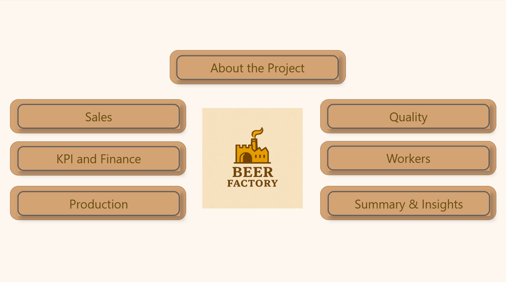
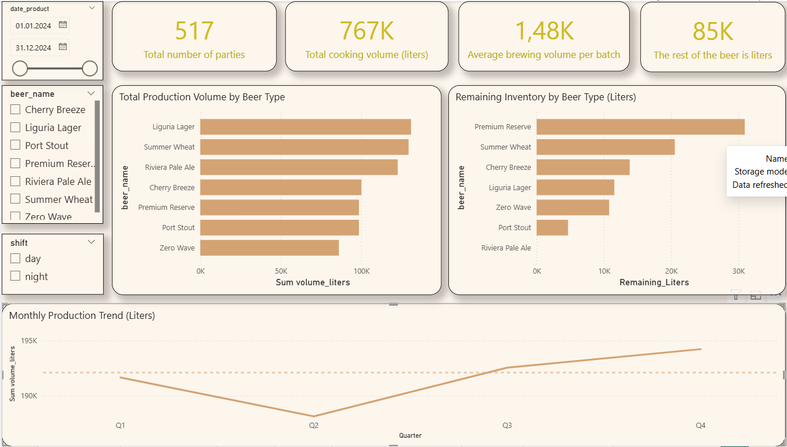
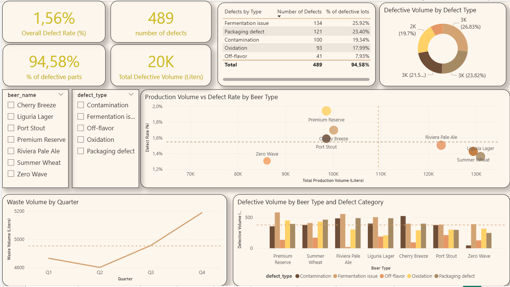
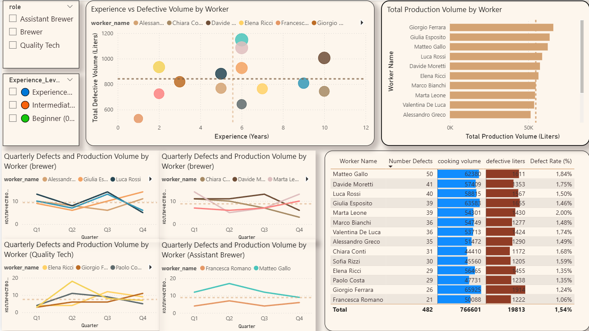
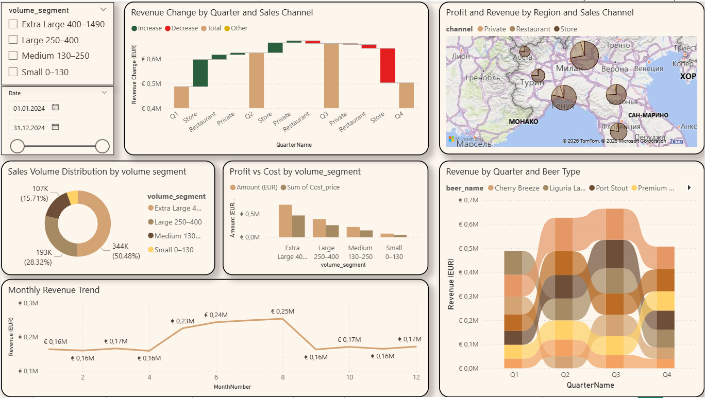
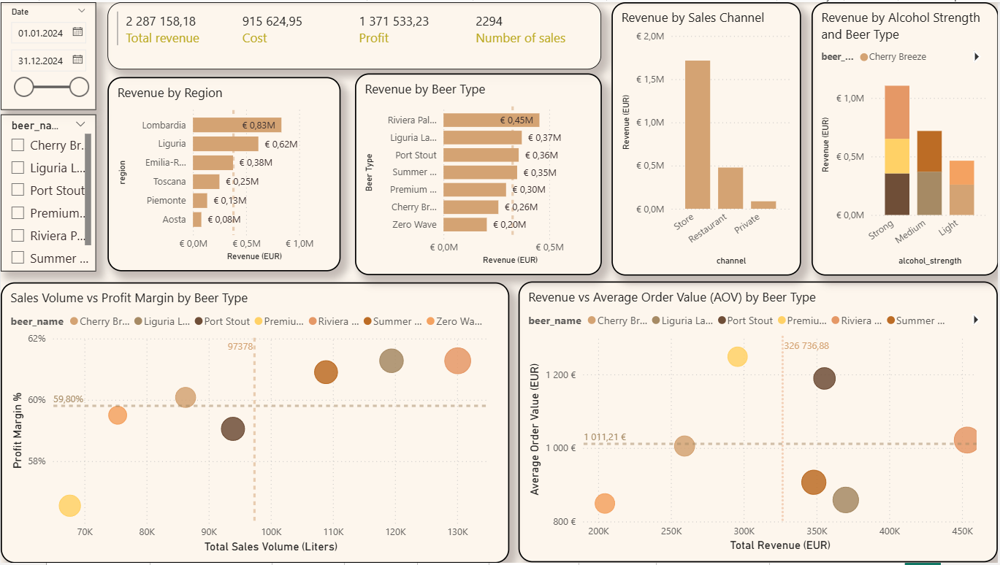
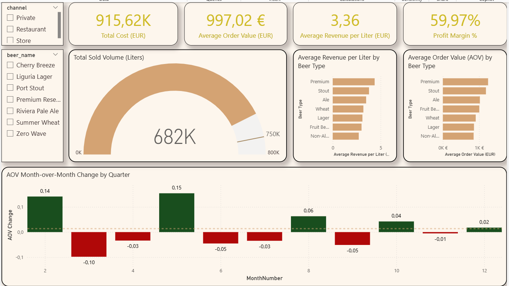
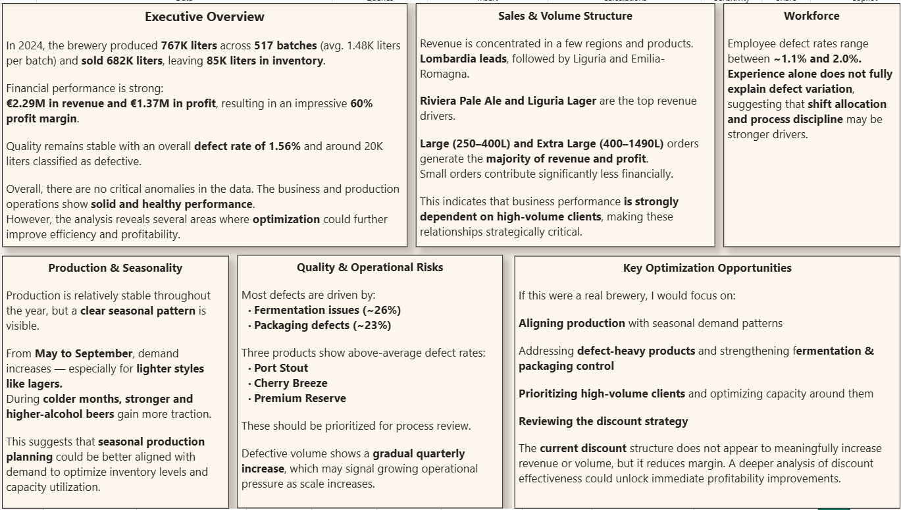

# Craft Brewery Analytics --- Power BI Business Report

##  Project Overview

This project presents a structured, multi-page Power BI business
analytics report simulating a real-world craft brewery environment.

The objective was not only to build dashboards, but to analyze how
production, quality control, workforce performance, sales structure, and
financial KPIs interact to drive overall business performance.

The report integrates multiple business domains into a unified
analytical model and transforms raw operational data into
executive-level insights.

------------------------------------------------------------------------

##  Business Objectives

-   Monitor production volumes and capacity usage
-   Analyze defect rates and operational risks\
-   Evaluate workforce efficiency\
-   Understand revenue drivers by region, channel, and product\
-   Assess profitability through KPIs such as AOV, Profit Margin, ROI\
-   Identify seasonal patterns in demand\
-   Detect optimization opportunities

------------------------------------------------------------------------

##  Report Structure

###  Cover / Navigation Page

Interactive menu to navigate across all business domains.

------------------------------------------------------------------------

###  Production

-   Total production volume\
-   Average batch size\
-   Remaining inventory\
-   Monthly production trend\
-   Production by beer type

------------------------------------------------------------------------

###  Quality

-   Overall defect rate\
-   Defect volume\
-   Defect breakdown by type\
-   Defect rate by beer\
-   Quarterly waste trend

------------------------------------------------------------------------

###  Workforce

-   Production volume by employee\
-   Defect rate by worker\
-   Experience vs defect analysis\
-   Quarterly performance comparison

------------------------------------------------------------------------

###   Sales (2 Pages)

Sales Overview: - Revenue by region\
- Revenue by beer type\
- Revenue by channel\
- Alcohol strength performance

Sales & Volume Analysis: - Volume segmentation (Small / Medium / Large /
Extra Large)\
- Profit vs Cost by segment\
- Revenue trend\
- AOV & Margin relationships

------------------------------------------------------------------------

###  KPI & Finance

-   Total Revenue\
-   Total Cost\
-   Profit\
-   Profit Margin\
-   AOV\
-   Volume Gauge\
-   Month-over-Month analysis

------------------------------------------------------------------------

### Summary & Insights

Executive conclusions including:

-   Strong financial performance (\~60% margin)\
-   Stable operations with low defect rate (1.56%)\
-   Clear seasonal demand patterns\
-   Revenue concentrated in high-volume clients\
-   Optimization opportunities in production planning and discount
    strategy

------------------------------------------------------------------------

##  Key KPIs

-   Total Revenue\
-   Total Profit\
-   Profit Margin (%)\
-   Average Order Value (AOV)\
-   ROI\
-   Defect Rate (%)\
-   Production Volume\
-   Remaining Inventory

------------------------------------------------------------------------

##  Tools Used

-   Power BI (Data Modeling, DAX, Visualization Design)
-   Multi-table relational data model
-   Custom KPI calculations
-   Interactive filters and navigation buttons

------------------------------------------------------------------------

##  Project Purpose

This project demonstrates:

-   Data modeling skills\
-   KPI design\
-   Business-oriented thinking\
-   Ability to translate data into executive insights\
-   Dashboard storytelling\
-   Multi-domain analytics (Production, Sales, Finance, Operations)
